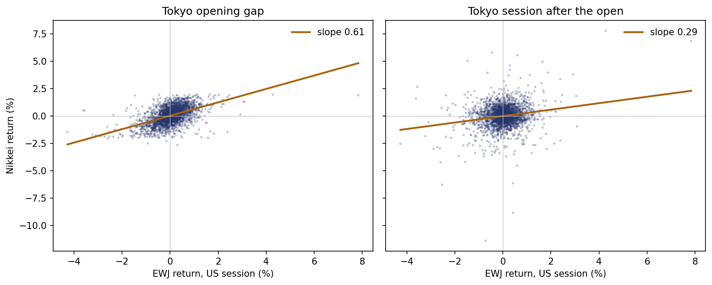
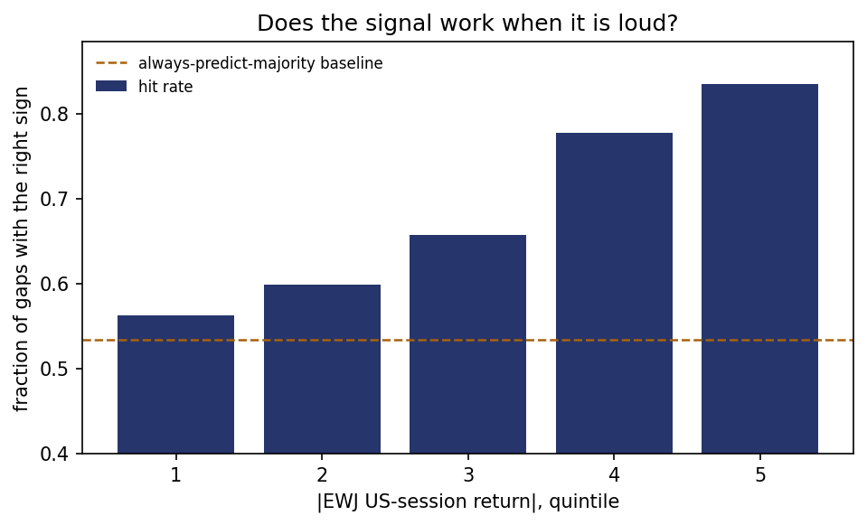
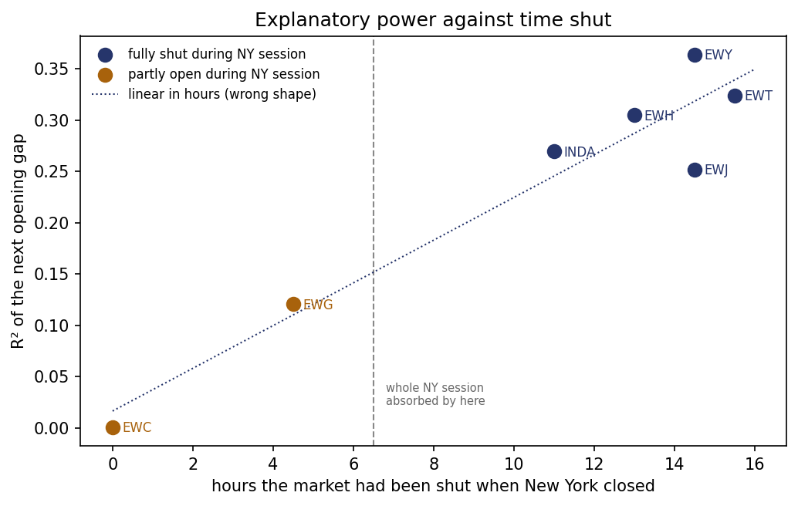
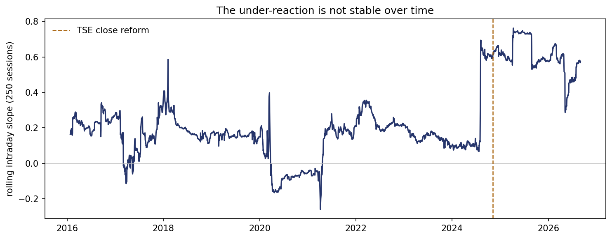

# Do US-listed ETFs price markets that are closed?

Measuring whether a US-listed Japan ETF forecasts the next Tokyo session, whether
that relationship holds on data it has never seen, and whether the same thing
happens in nine other markets.

**Headline:** it does — a slope of 0.61 on Tokyo's opening gap across 2,753
sessions, surviving two falsification tests and holding out of sample on
coefficients frozen before 2021. The effect appears wherever a market is shut
during New York hours and disappears where one is not: Canada, whose exchange
closes at the same instant as New York, returns an R² of **0.001**. There is also
residual predictability *into* the Tokyo session, small historically but roughly
five times larger since 2024. A structural explanation for that change was tested
and rejected.



---

## The question

The Tokyo Stock Exchange closes at 15:30 JST — 02:30 in New York. EWJ, a
US-listed fund holding Japanese equities, then trades in New York from 09:30 to
16:00, roughly thirteen and a half hours after every share it holds last traded.

For that whole window the basket is frozen. Nothing in it is moving. So EWJ's
open-to-close return is **not** the basket changing value — it is traders
revising their estimate of what Japanese equities are worth, on information that
arrived after Tokyo shut.

That reframes the fund's price as a forecast, and the forecast is testable:
**does Tokyo open where EWJ said it would?**

The reframing also makes the project cheap. Because the basket's value is
constant over the window, the ETF's own return *is* the change in its premium to
net asset value — so no fund accounting data is needed, only free daily prices.

## Method

- **Signal** — EWJ's log return from the New York open to the New York close.
- **Targets** — the Nikkei 225's *opening gap* (open versus previous close) and
  its *intraday return* (open to close) in the next Tokyo session.
- **Sample** — 2015 to 2026, 2,753 matched sessions.

Splitting the target this way separates two questions. If the ETF has done real
price discovery, the information should appear in the **opening gap**. Anything
predictable in the **intraday** move means the open under-reacted and the market
carried on catching up during the day.

### The part that decides whether any of this is real

On any calendar date `d`, Tokyo's session for `d` ran from roughly 20:00 on
`d−1` to 02:30 on `d` New York time, while New York's session for `d` runs 09:30
to 16:00. **New York's day-`d` session therefore happens after Tokyo's.** The
session being forecast is the *next* one.

Matching New York on `d` to Tokyo on `d` looks backwards in time. Rather than
assume "`d+1`", the code looks up the next Tokyo session explicitly, so weekends
and each country's holidays are handled without assumption — necessary because
the two calendars are independent. A US holiday does not imply a Tokyo holiday,
and the tests pin exactly that case.

The tests run on fabricated data with a planted slope of 0.8. The correct
alignment recovers 0.81; the look-ahead version collapses to 0.09.

### One foreign session, one observation

An early version mapped several US sessions onto the same Tokyo session. Japan
has around sixteen public holidays a year, many on Mondays, and when Tokyo is
shut while New York trades, both the Friday and the Monday US session point
forward to the same Tokyo open. Those rows share a `y` value, so they are not
independent observations — which understates the standard errors and inflates
the t-statistics.

It affected **146 rows, exactly 5.0% of the sample**, and was invisible in the
summary statistics; it surfaced only when matched pairs were printed and read by
hand. The pipeline now keeps the *last* US session before each foreign session,
on the grounds that earlier information is already reflected in that session's
opening price, and the tests assert that no foreign session is ever used twice.

## Results

Full sample, 2,753 sessions, January 2015 to September 2026:

| | slope | std. error | t | R² |
|---|---|---|---|---|
| **Tokyo opening gap** | 0.612 | 0.020 | 30.4 | 0.251 |
| **Tokyo intraday** | 0.294 | 0.030 | 9.9 | 0.035 |

A 1% move in EWJ during the New York session is associated with the Nikkei
opening 0.61% higher, and EWJ's afternoon in New York explains about a quarter
of the variance in where Tokyo opens.

### How often is the direction right?

The slope says how much of the ETF's move Tokyo repeats. It does not say how
often the sign is right, which is the first thing anyone asks. Both numbers are
reported against a baseline, because a hit rate alone is meaningless: if the
Nikkei gapped up 55% of the time, a forecast that always said "up" would score
55% and have learned nothing.

| target | hit rate | baseline | edge | n |
|---|---|---|---|---|
| **Tokyo opening gap** | 0.689 | 0.535 | **+0.155** | 2,679 |
| Tokyo intraday | 0.511 | 0.501 | +0.009 | 2,678 |

The intraday effect has a significant slope and essentially no directional
content. Whatever it is, it is not a usable statement about which way Tokyo moves
after the open.

The gap result behaves the way information should — the louder the signal, the
more often it is right:

| quintile of \|EWJ return\| | mean \|return\| | hit rate | baseline | edge | n |
|---|---|---|---|---|---|
| 1 (quietest) | 0.05% | 0.562 | 0.518 | +0.044 | 475 |
| 2 | 0.16% | 0.599 | 0.548 | +0.051 | 551 |
| 3 | 0.30% | 0.657 | 0.563 | +0.094 | 551 |
| 4 | 0.50% | 0.777 | 0.537 | +0.240 | 551 |
| 5 (loudest) | 1.10% | **0.835** | 0.505 | **+0.330** | 551 |

Monotonic in all five buckets. The baseline does not trend with them — it runs
0.518, 0.548, 0.563, 0.537, 0.505, peaking in the middle and lowest in the
loudest bucket — so the rise is not the outcome's own drift leaking in, and the
edge grows faster than the hit rate does. A slope fitted through noise would not
do this.



## Robustness: two attempts to kill it

**Placebo.** Shuffling the signal so it no longer lines up with the session it
supposedly predicts gives slopes of −0.019 (t = −0.8) and −0.001 (t = −0.0),
with R² below 0.001 in both cases. The matching procedure is not manufacturing
structure.

**Control.** Running the identical pipeline on SPY against the S&P 500 — where
no time-zone gap exists, so there is nothing to forecast:

| | slope | t | R² |
|---|---|---|---|
| gap | −0.029 | −2.5 | 0.002 |
| intraday | −0.110 | −5.7 | 0.011 |

Small, **negative**, and an order of magnitude below the Japanese result. The
sign matters: a pipeline fabricating a spurious positive relationship would
fabricate one here too. What appears instead is consistent with the known
short-horizon reversal in US equity indices — a different mechanism, in the
opposite direction.

Note also that the gap control is "significant" at t = −2.5 while explaining
0.2% of variance. With nearly 3,000 observations, trivial effects clear
significance thresholds automatically. Statistical significance and magnitude
are different questions.

## Out of sample: a third attempt to kill it

Both tests above are computed on the same data the slope was fitted on. They rule
out particular artefacts; they do not ask whether the relationship survives
predicting something it has never seen.

**Frozen split.** Fit once on everything before 2021, then never look at the
training period again.

| | slope | std. error | t | R² | n |
|---|---|---|---|---|---|
| train, < 2021 | 0.655 | 0.032 | 20.3 | 0.225 | 1,418 |
| test, ≥ 2021 (refit) | 0.584 | 0.026 | 22.9 | 0.281 | 1,337 |

Applying the **training** coefficients unchanged to the test period gives
**R²ₒₒₛ = +0.277**, with the direction right on 70.9% of sessions against a 54.5%
baseline.

**Walk-forward.** Refit on every session up to *i*, predict session *i*, step
forward. Nothing is ever fitted on data at or after the session being predicted.
Over 2,255 predictions: **R²ₒₒₛ = +0.254**, hit rate 0.691 against 0.542.

Both figures are scored against the *training-period mean*, not the test mean:

```
R²ₒₒₛ = 1 − Σ(actual − predicted)² / Σ(actual − training mean)²
```

The training mean is the only rival forecast available at the time. Scoring
against the test mean instead — which is what a correlation computed on the test
period effectively does — hands the model knowledge of the period it is being
graded on. Defined this way the statistic can go negative, and a negative value
would be a real result: worse than predicting the historical average.

The training slope of 0.655 falls to 0.584 out of sample, a decline of about 11%,
consistent with the gradual drift in the sub-period table below. It is worth
being precise that this is the **gap** relationship. The five-fold 2024 jump
documented further down is in the **intraday** slope, and the two should not be
read as one unstable effect.

## The mechanism's own prediction, across ten markets

If EWJ forecasts Tokyo because Tokyo has been shut while news arrived, then the
same thing should happen wherever a market is closed during New York hours, and
it should happen *more* the longer that market has been shut. That is a
prediction the story cannot wriggle out of — and a market closing at the same
moment as New York has no window at all, so it should show nothing.

**Hours shut** is derived rather than typed in: each local close is converted to
UTC using its standard offset and measured against New York's 16:00 (21:00 UTC).
Daylight saving moves several by an hour, and the southern hemisphere moves the
other way, so read each figure as ±1h — far below the spacing the test needs.

| ETF | index | market | hours shut | share of NY session missed |
|---|---|---|---|---|
| EWC | `^GSPTSE` | Canada | 0.0 | 0% |
| EWZ | `^BVSP` | Brazil | 1.0 | 15% |
| EWU | `^FTSE` | UK | 4.5 | 69% |
| EWG | `^GDAXI` | Germany | 4.5 | 69% |
| INDA | `^NSEI` | India | 11.0 | 100% |
| EWH | `^HSI` | Hong Kong | 13.0 | 100% |
| EWJ | `^N225` | Japan | 14.5 | 100% |
| EWY | `^KS11` | Korea | 14.5 | 100% |
| EWA | `^AXJO` | Australia | 15.0 | 100% |
| EWT | `^TWII` | Taiwan | 15.5 | 100% |

### Three markets had to be dropped, and not for a statistical reason

Some index feeds synthesise the opening price from the previous close instead of
reporting it. Where that happens the overnight gap is zeros by construction, R²
collapses, and the market looks like evidence *against* the mechanism when it is
really evidence of a dead feed. Fraction of sessions whose `Open` is *exactly*
the prior `Close`:

| market | opens equal to the prior close | verdict |
|---|---|---|
| UK, `^FTSE` | **94.4%** | unusable |
| Australia, `^AXJO` | **72.0%** | unusable |
| Brazil, `^BVSP` | **27.0%** | unusable |
| the seven others | ≤ 0.2% | fine |

Yahoo's FTSE series essentially never reports a real open. This is the same
failure that makes Yahoo's daily FX `Open` unusable (§ Currency), in a different
dataset — which suggests checking for it by default rather than on suspicion. The
check runs before the regression, so a dead feed cannot be reported as a null
result.

### The seven that survive

| market | hours shut | slope | t | R² | hit / base | n |
|---|---|---|---|---|---|---|
| Canada | 0.0 | −0.014 | −1.4 | **0.001** | 0.541 / 0.568 | 2,880 |
| Germany | 4.5 | 0.365 | 19.9 | 0.120 | 0.621 / 0.561 | 2,888 |
| India | 11.0 | 0.538 | 32.1 | 0.269 | 0.686 / 0.666 | 2,795 |
| Hong Kong | 13.0 | 0.858 | 35.0 | 0.305 | 0.714 / 0.560 | 2,805 |
| Japan | 14.5 | 0.612 | 30.4 | 0.251 | 0.689 / 0.535 | 2,755 |
| Korea | 14.5 | 0.552 | 39.8 | **0.364** | 0.734 / 0.599 | 2,775 |
| Taiwan | 15.5 | 0.390 | 36.3 | 0.324 | 0.728 / 0.592 | 2,750 |

Regressed across the seven, R² rises by **2.1 points per hour shut** (t = 7.5,
R² of the ladder itself 0.919).



India is worth a note: its R² of 0.269 is among the highest, but its directional
edge is only +0.020, because the Nifty gaps up two thirds of the time and almost
all of that hit rate is drift. It is the clearest illustration of why the
baseline sits next to every hit rate in this README.

### Canada is the result

A market that closes at the same instant as New York cannot be forecast by an ETF
trading in New York, even in principle. Canada returns R² 0.001, a slope that is
negative and insignificant, and a directional edge of −0.027 across 2,880
sessions. The zero point lands on zero.

This is a stronger control than SPY against the S&P 500. That pair is an ETF
measured against its own index — same market, same hours — so it tests the
plumbing: whether the matching logic manufactures a slope out of nothing. EWC
against the TSX is a genuine foreign-market ETF whose market happens to keep New
York's hours. It holds the ETF wrapper fixed and removes only the time zone,
which is the variable the entire argument rests on.

### What the ladder does not show

Three things worth stating plainly, because that t of 7.5 is more flattering than
the evidence behind it.

**It is seven markets, not 19,000 sessions.** The statistic is computed across
markets and should not be read alongside the t of 30 on the Japan regression.
Different sample sizes, different claims.

**Canada anchors the line.** It is the only observation below 4.5 hours. Dropping
it takes the fit from t 7.5 to t 3.9 and R² 0.919 to 0.795 — still present, but
the clean control is doing most of the work. The honest summary is that the
effect *switches on when there is a window*, not that power scales smoothly with
hours.

**There is no ordering at the top.** Among the five markets that miss the entire
New York session, extra hours buy nothing measurable: Hong Kong at 13.0h (0.305)
beats Japan at 14.5h (0.251), and Korea at 14.5h is the highest of all at 0.364
while Taiwan at 15.5h sits at 0.324. Regressing R² on hours within that group
gives t = 0.8.

That flatness is what the mechanism predicts. Information reaches New York only
during New York's own session, so once a market has missed all 6.5 hours there is
nothing further to absorb and the fifteenth hour shut is dead time. But five
points spanning 11 to 15.5 hours could not have detected a modest slope either
way, so this is *consistent with* saturation rather than evidence for it. Fitting
the saturating form explicitly — R² on the share of the session missed — gives
R² 0.852 against 0.919 for the linear one. With seven points the two shapes
cannot be separated, and neither fit says anything about the functional form.

> Session counts here differ by one or two from the 2,753 quoted above simply
> because the cross-market run is more recent.

## The relationship is not stable

| period | gap | intraday | intraday R² | n |
|---|---|---|---|---|
| 2015–2019 | 0.772 | 0.160 | 0.008 | 1,183 |
| 2020–2023 | 0.560 | 0.106 | 0.006 | 944 |
| 2024–2026 | 0.534 | **0.628** | **0.140** | 626 |

The gap coefficient declines gradually. The intraday coefficient does something
else entirely — flat and small for nine years, then roughly five times larger,
with a twenty-fold jump in explanatory power.

Information that used to arrive at Tokyo's open now arrives during the session.



## A mechanism, tested and rejected

The Tokyo Stock Exchange extended its close from 15:00 to 15:30 and introduced a
closing auction on **5 November 2024** — inside the window where the change
appears. A closing auction concentrates end-of-day liquidity into one
price-forming event, which is a plausible reason for more information to be
absorbed within the session.

Splitting on the exact reform date rather than the calendar year:

| | intraday slope | t | n |
|---|---|---|---|
| pre-2024 baseline | 0.129 | 3.9 | 2,127 |
| Jan – 4 Nov 2024 (**before** reform) | 0.751 | 5.3 | 199 |
| 5 Nov 2024 onward (**after** reform) | 0.595 | 8.8 | 427 |

**Rejected.** The effect was already elevated — higher, in fact — before the
reform took effect. Whatever changed in 2024, it was not the closing auction.

The gap coefficient *does* fall across that date, from 0.743 to 0.472, in the
direction the mechanism predicts. But that rests on 199 observations, and by
this point roughly a dozen subsample regressions had been run; with enough
splits, one will look significant by chance. It is recorded here as something
worth further work, not as a second result.

## Sensitivity to extreme days

| recent sample (2024–2026) | intraday slope | R² | n |
|---|---|---|---|
| all days | 0.628 | 0.140 | 626 |
| top 1% by \|signal\| removed | 0.454 | 0.054 | 619 |
| ten largest days removed | 0.426 | 0.046 | 616 |

Removing **seven days out of 626** cuts the slope by 28% and R² by more than
half. The effect survives — 0.426 against a pre-2024 baseline of 0.129 is still
more than three times larger — but it is materially smaller than the headline
figure and materially dependent on a handful of extreme sessions. The August
2024 carry-trade unwind falls in this window.

## Currency

EWJ is priced in dollars, so part of its move is the yen rather than Japanese
equities. Correcting for this requires care in two places.

**The data.** Yahoo's daily FX `Open` is effectively that day's close — a third
of rows have `Open == Close` exactly, and the implied daily volatility is 0.02%
against a true USDJPY figure near 0.5%. The field looks entirely plausible and
is meaningless. Hourly `Close` values aligned to the 09:30–16:00 New York window
give a session volatility of **0.294%**, which is what USDJPY actually does.

**The sign.** `JPY=X` quotes yen per dollar, so the correction *adds* its return
rather than subtracting it. Verified on synthetic data, where the wrong sign
gives a correlation of 0.71 with the true equity return against 0.89 for making
no correction at all — worse than doing nothing.

On the two-year overlapping sample, both variants:

| | slope | t | R² |
|---|---|---|---|
| raw dollar returns | 0.528 | 14.7 | 0.250 |
| currency-adjusted | 0.523 | 15.8 | **0.278** |

The slope is unchanged while the fit improves. Simple attenuation would predict
the slope rising, so the yen is not behaving as pure measurement noise. The
likely reason: a weaker yen lifts Japanese exporters and so predicts a higher
Nikkei, while mechanically pushing a dollar-priced ETF *down*. Removing it gives
a cleaner equity signal but discards a term with predictive content of its own.

## Limitations

- **EWJ tracks MSCI Japan, not the Nikkei 225** — different constituents, and
  the Nikkei is price-weighted. Part of the shortfall from a slope of 1 is this
  basis rather than anything about markets. TOPIX would be a closer comparison.
- **Index opening prices may be stale.** The Nikkei's open is computed from 225
  constituents that do not all trade immediately. That alone would depress the
  gap coefficient and inflate the intraday one — the exact pattern observed.
  Distinguishing it requires intraday index data; if genuine under-reaction, the
  drift should spread through the session rather than concentrating in the first
  minutes.
- **Three of ten index feeds do not report an open at all.** `^FTSE` returns the
  previous close as the open on 94.4% of sessions, `^AXJO` on 72.0%, `^BVSP` on
  27.0%. All three were dropped. The seven used are under 0.2%, but a subtler
  version of the same corruption would pass this check unnoticed.
- **The cross-market ladder rests on seven markets** and its slope is anchored by
  a single zero-hour control. Index composition, liquidity and daily price limits
  differ across them in ways the hours-shut variable does not capture — Taiwan
  caps daily moves at ±10%, which truncates exactly the tail the signal is
  strongest in.
- **Standard errors are ordinary OLS.** Returns cluster in volatility, so the
  true errors are wider. At t of 20–30 the conclusions are unaffected, but the
  figures are indicative.
- **Nothing here is tradeable.** Nikkei futures trade nearly around the clock on
  CME and Osaka's night session, so the overnight gap is already priced before
  Tokyo opens. This measures price discovery, not an opportunity.
- **Multiple testing.** Several subsample splits were run; the reported gap break
  at November 2024 should be treated accordingly.

## What I would do next

1. **Race the ETF against Nikkei futures.** The sharp question is whether EWJ
   carries information *beyond* what the overnight futures already show. A null
   result would be a strong result.
2. **Intraday index data** to separate genuine under-reaction from stale opening
   prices.
3. **Fill the 5-to-11-hour gap in the ladder.** Nothing sits between Germany at
   4.5 hours and India at 11, which is where a linear and a saturating shape
   differ most — and the two markets that would have filled it, the UK and
   Brazil, are the ones with dead feeds. South Africa and Israel are the
   accessible candidates; an index feed that reports real opens would also
   recover the UK and Australia.
4. **Run the ladder on the intraday target too.** It has only been run on the
   opening gap. If the under-reaction is real, it should scale differently — or
   not at all.
5. **Newey–West or bootstrapped standard errors.**

## Prior work

This phenomenon is documented. Antti Petajisto, *Inefficiencies in the Pricing
of Exchange-Traded Funds* (Financial Analysts Journal, 2017), finds ETF prices
fluctuating within a band of roughly 200 basis points around net asset value —
about 100 after controlling for stale pricing — with the largest deviations in
international and illiquid funds. This project is a replication on free data,
extended by the stability analysis, by testing a specific structural hypothesis,
and by the cross-market test above.

## Running it

```bash
pip install -r requirements_1.txt
python Analysis.py       # the main result
python Extension.py      # hit rate, out of sample, ten markets
```

Self-tests run first in both files and need no internet — if they pass, the logic
is sound and any later failure is a data or network problem. Market data is
cached in `data_cache/` on first run, so subsequent runs are offline and instant.

`Extension.py` imports `get`, `align` and `fit` from `Analysis.py` unchanged, so
nothing in it can move the headline number.

| file | |
|---|---|
| `Analysis.py` | self-tests, data, main analysis, figures |
| `Extension.py` | hit rate, out-of-sample tests, the ten-market ladder |
| `etf_step1_2.ipynb` | the exploratory notebook this grew out of |
